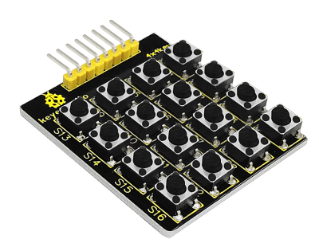
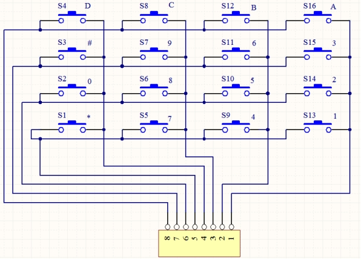
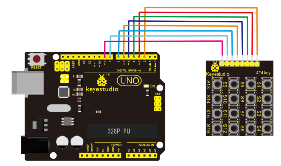
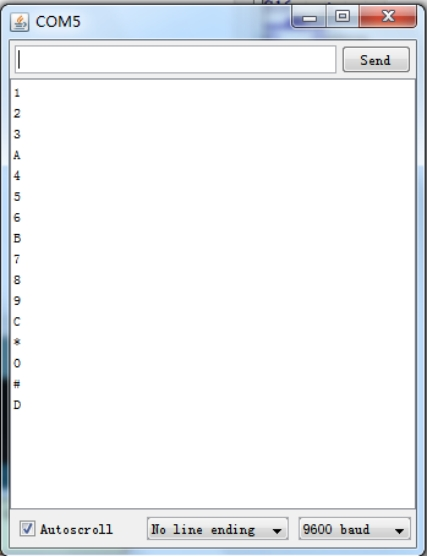

# KS0060 keyestudio Large Button 4*4 Matrix Keypad for Arduino



## 1. Introduction

In the application system of microcontroller, keyboard is essential in man-machine dialogue.

When you are short of a button, you can connect one to the I/O port of the comtroller; but when you need a lot of buttons with limited I/O port resources, this 4 * 4 Matrix Keypad is no doubt your best choice.

The 4 * 4 matrix keypad is the most applied keypad form. We need to master its keypad identification technology as entry to microcontroller world. 

Here, we will use an examples to illustrate the identification method of 4 * 4 matrix keypad. The key layout is in matrix form, so with only eight I/O ports, we can identify 16 buttons, saving lots of I/O port resources.

**Pin layout for 4\*4 Large Button module:**



## 2. Circuit connection

Connect module pin 1-8 in sequence to board digital pin 2-9, as below picture.



## 3. Sample program

Download  Resources:  [Resources](./Resources.7z)

Note： before uploading the code, you need to import the library files; otherwise, the code upload will fail.

```c
#include <Keypad.h>
const byte ROWS = 4; // define row 4
const byte COLS = 4; // define column 4
char keys[ROWS][COLS] = {{'1','2','3','A'},{'4','5','6','B'},{'7','8','9','C'}{'*','0','#','D'}};
// connect row ports of the button to corresponding IO ports on the board
byte rowPins[ROWS] = {2,3,4,5};	
// connect column ports of the button to corresponding IO ports on the board
byte colPins[COLS] = {6,7,8,9};
// call class library performance function of Keypad 
Keypad keypad = Keypad( makeKeymap(keys), rowPins, colPins, ROWS, COLS );

void setup()
{
	Serial.begin(9600);
}

void loop()
{
    char key = keypad.getKey();
    if (key != NO_KEY)
    {
    	Serial.println(key);
    }
}
```

## 4. Program test

Upload the program to the board, open serial monitor; press certain button on the module, it will display corresponding value as below picture showed:

